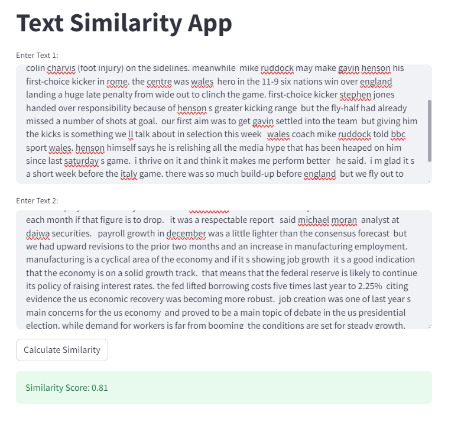

# Text similarity between two documents

## Objective
This guide explains how to calculate text similarity between two texts using Python. Text similarity measures help you determine how closely related or similar two texts are to each other.


## Setup

1.**Clone the Repository**: Clone this repository to your local machine:

```
git clone https://github.com/Riya-arora611/text-similarity.git
cd text-similarity
```

2.**Install Dependencies**: Create a virtual environment and Install the required dependencies using pip:

```
python3 -m venv venv
source venv/bin/activate
pip3 install -r frontend/requirements.txt
pip3 install -r backend/requirements.txt
```

3.**Start the servers**: To start the backend server for the model you can run:

```python3 backend/main.py```

**and in new terminal start frontend server using streamlt UI:

```streamlit run frontend/streamlit_app.py```**


### Input

The  input of this module is two text. Now to send request to the backend server you can use:

```
curl --location --request POST 'http://your-ip-here:8000/text-similarity' --header 'Content-Type: application/json'  --data-raw '{"text1":"Hello how are you","text2":"hi how are you"}'
```

**replace your ip here in the above command**

The output of this can be seen here:

```
{"similarity_score":0.9729417562484741}
```

To test the whole application on local using frontend you can go to the link: 

```http://localhost:8501```


## Containerising this code

To ensure the consistency between different environments we should encapsulate our application using Docker. Docker containers can be easily packaged, shipped, and deployed across different environments. Containers share the host system's kernel, which reduces the overhead of running multiple instances of an operating system. Docker facilitates a streamlined CI/CD pipeline. With containers, you can build, test, and deploy applications consistently and automatically. 

1. If you want to run this in a docker container, the docker compose file is already made for this purpose. You can just build the image and run the container using:

```
sudo docker-compose up 
```
Once you get the following info means the docker containers are up and running now and ready to test:

```
tokenizer_config.json: 100%|██████████| 28.0/28.0 [00:00<00:00, 7.75kB/s]
vocab.txt: 100%|██████████| 232k/232k [00:00<00:00, 1.88MB/s]
tokenizer.json: 100%|██████████| 466k/466k [00:00<00:00, 804kB/s]
config.json: 100%|██████████| 570/570 [00:00<00:00, 1.63MB/s]
model.safetensors: 100%|██████████| 440M/440M [01:09<00:00, 6.36MB/s] 
text-similarity-backend-1   | INFO:     Started server process [7]
text-similarity-backend-1   | INFO:     Waiting for application startup.
text-similarity-backend-1   | INFO:     Application startup complete.
text-similarity-backend-1   | INFO:     Uvicorn running on http://0.0.0.0:8000 (Press CTRL+C to quit)
```


To access the dockerised app from frontend now you can use:

```
http://localhost:8501
```

The deployed application is accessible here:

```
http://54.164.28.252:8501
```

## Solution Approach

This code is designed to calculate the similarity score between two text texts, using BERT embeddings and cosine similarity. Here's a summary of what each part of the code does:

- Load Pre-trained BERT Model and Tokenizer: It loads a pre-trained BERT model (bert-base-uncased) and its corresponding tokenizer. BERT (Bidirectional Encoder Representations from Transformers) is a state-of-the-art language representation model.


- Encode Text into BERT Embeddings: It encodes the extracted text from the resume and job description into BERT embeddings using the bert_encode function.

- Compute Similarity Score: The code calculates the similarity score between the two sets of BERT embeddings using cosine similarity. The similarity score represents how closely related the resume and job description are in terms of content. It's a value between 0 and 1, with higher values indicating greater similarity.



